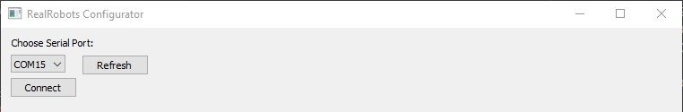
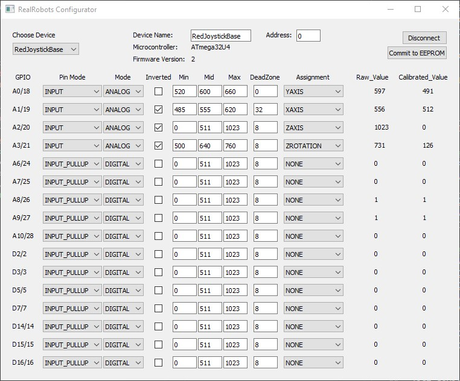
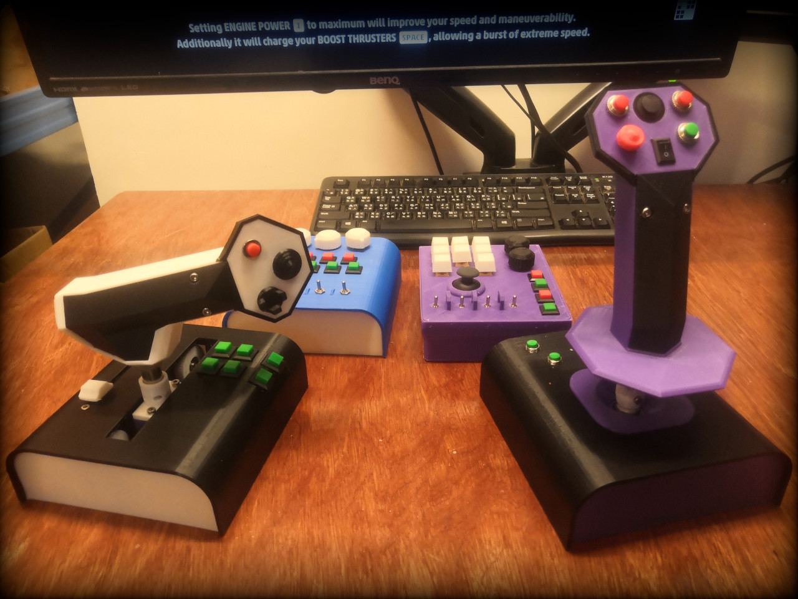

# RealRobots Configurator

## What is it?

The configurator is an app that runs on a PC and communicates with the RealRobots Modular [game controller firmware](https://gitlab.com/realrobots/rr_controller), allowing configuration of all analog and digital inputs as Joystick axis and buttons.

## How to use it?

Connect your device to a USB port on your PC

If you haven't already, upload the [rr_controller](https://gitlab.com/realrobots/rr_controller) firmware to it using the Arduino IDE

Download the [current distribution](./rr_configurator.zip) and decompress.

Run rr_configurator.exe

Select the correct port and press "Connect".

You are now connected and can configure your device.

## Tips

The device that you intend to be the parent device that will connecd to the USB has to be assigned address 0. Only a device with address 0 will attempt to connect to other devices connected to it and send HID joystick inputs to the computer.

Each device requires a unique address 0..255

All changes are instantly applied to the device, but will revert when the device is power cycled unless "Commit to EEPROM" is used to commit the values to EEPROM. Committing to EEPROM only applies to the currently selected device.

Pins D2 and D3 are special cases as they are used for communication between devices. If no child devices are connected they **should** be assignable and work normally, though this hasn't been tested.

**Choose Device**: Will list connected devices if you are connected to device address 0 using USB and other devices have unique addresses 1..255.

Choose a device from this dropdown to configure it.

**PinMode**: "INPUT" sets a GPIO pin to receive inputs, "INPUT_PULLUP" does the same but also activates an internal pullup resistor. "OUTPUT" does nothing at the moment.

**Mode**:  "DIGITAL" converts an input into a binary 0 or 1. "ANALOG" provides the voltage applied to the pin in a 0..1023 value representing 0..5v input.

**Inverted**: If toggled flip a value, 0s become 1s and 1023 becomes 0 and vice versa.

**Min**: The minimum calibrated value, at or below this any input will be considered a 0. Only applies to analog inputs.

**Mid**: The center value, should be assigned whatever the raw_value is at rest, related to "DeadZone". Only applies to analog inputs.

**Max**: The maximum calibrated value, any value at or above this will be considered a 1023. Only applies to analog inputs.

**DeadZone**: A range around the Mid value, any input within this range will be reported at a 511 (halfway between 0 and 1023)

**Assignment**: The button or axis assigned to this input and which will be reported via HID as a joystick input to the PC.

**Raw Value**: The raw value being reported by the input pin.

**Calibrated Value**: The value after calibration and which will be reported via HID as a joystick input to the PC.

##### Get full DIY kits, ready to assemble from RealRobots [here](https://www.realrobots.net).

